# Mega Cart - Advanced E-Commerce Mobile Application

Mega Cart is a production-ready, feature-rich E-Commerce mobile application built using **Flutter**. The project is meticulously structured following **Clean Architecture** principles and software engineering best practices (**SOLID**, Feature-First approach) to ensure high scalability, maintainability, and top-tier performance.

---

## 🚀 Key Features

### 🔐 Authentication & Security

- **User Authentication:** Robust Login and Signup flows.
- **Email Verification:** OTP/Verification message handling for secure onboarding.
- **Security & Hardening:** Built-in mobile application security layers to safeguard user data.

#### 📸 Authentication & Security Showcase:

|            Splash Screen             |            Login Page            |            Signup Page             |
| :----------------------------------: | :------------------------------: | :--------------------------------: |
|  | 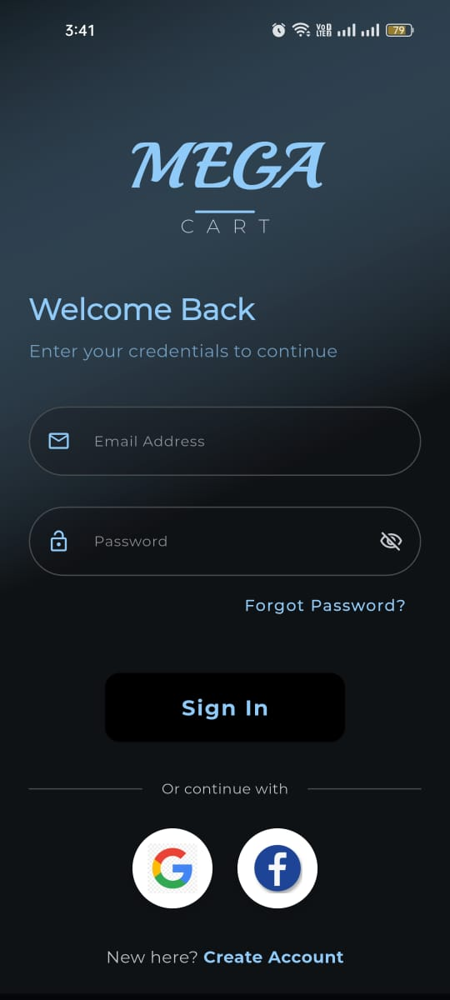 | 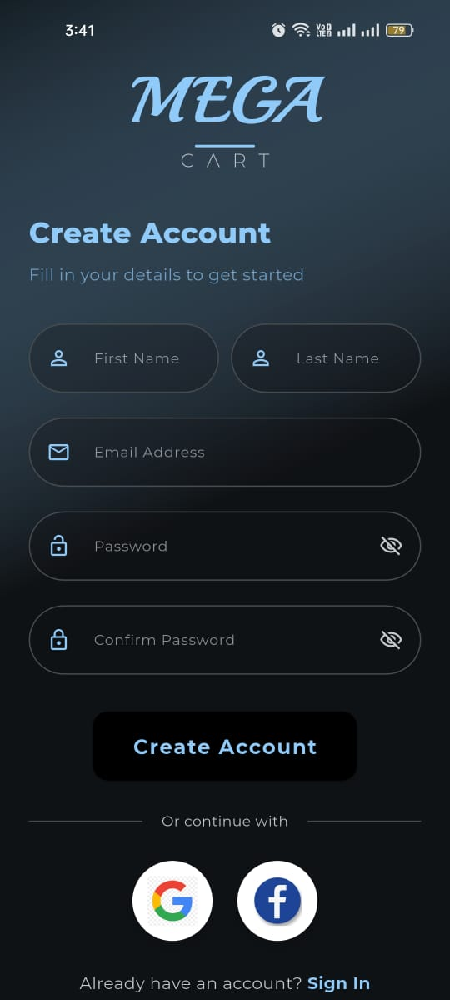 |

---

### 🛍️ Core E-Commerce Experience

- **Dynamic Home Screen:** Category-based filtering, advanced products listing, and real-time search functionality.
- **Premium Product Details:** Multi-image carousel/slider support, interactive quantity selector, and comprehensive product specs.
- **Cart & Wishlist Management:** Smooth state-driven "Add to Cart" and "Add to Wishlist" systems.
- **Checkout Flow:** Seamless checkout process connected instantly with an **Order History** tracker.

#### 📸 Core Shop Showcase:

|           Home Page            |              Categories Page              |                Single Product Page                |            Search Page             |
| :----------------------------: | :---------------------------------------: | :-----------------------------------------------: | :--------------------------------: |
| 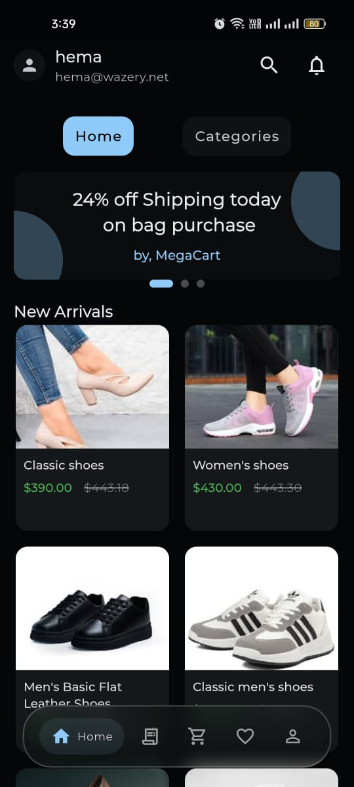 | 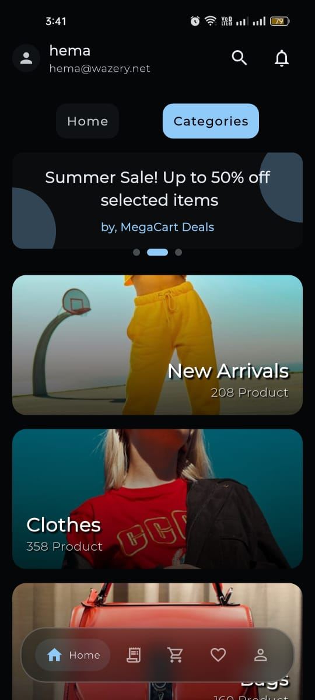 | 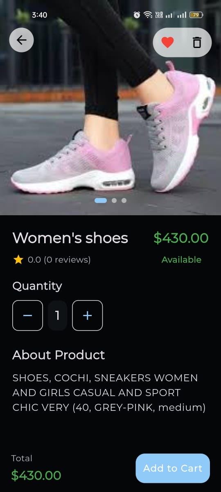 | 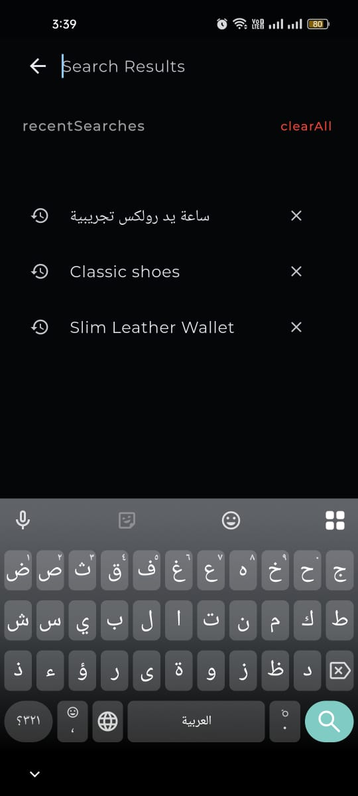 |

### 👤 Profile & User Settings

- **User Info Dashboard:** Displays personalized user data including name, email, and addresses dynamically fetched via secure APIs.
- **Address Management:** Comprehensive options to add, update, or clear shipping addresses.

#### 📸 cart & Wishlist Showcase:

|                cart Page                 |            orders Page             |             checkout Page              | Favorites Page |
| :--------------------------------------: | :--------------------------------: | :------------------------------------: | -------------- |
|      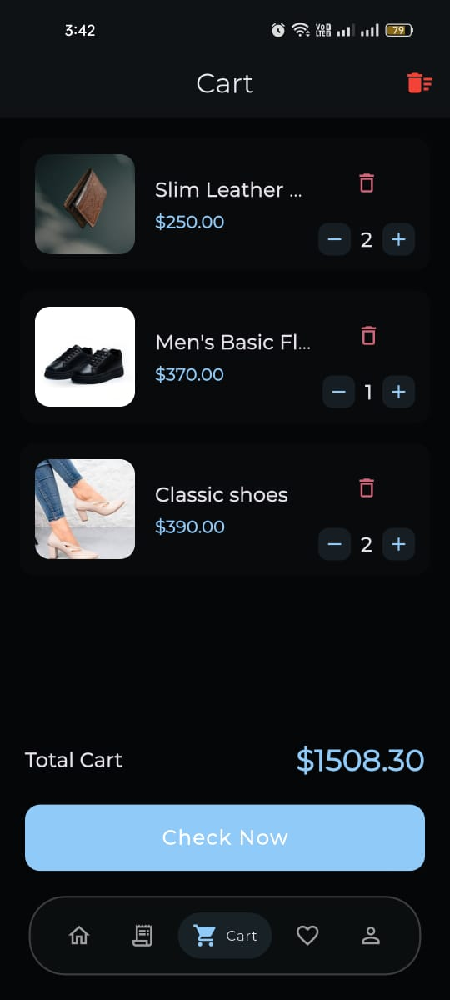      | 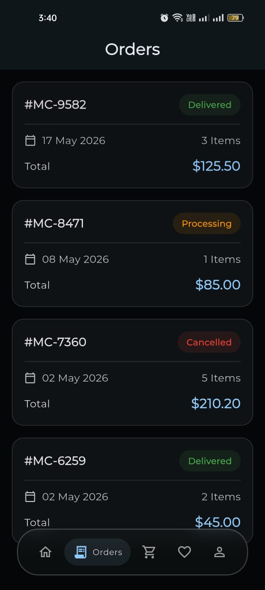 | 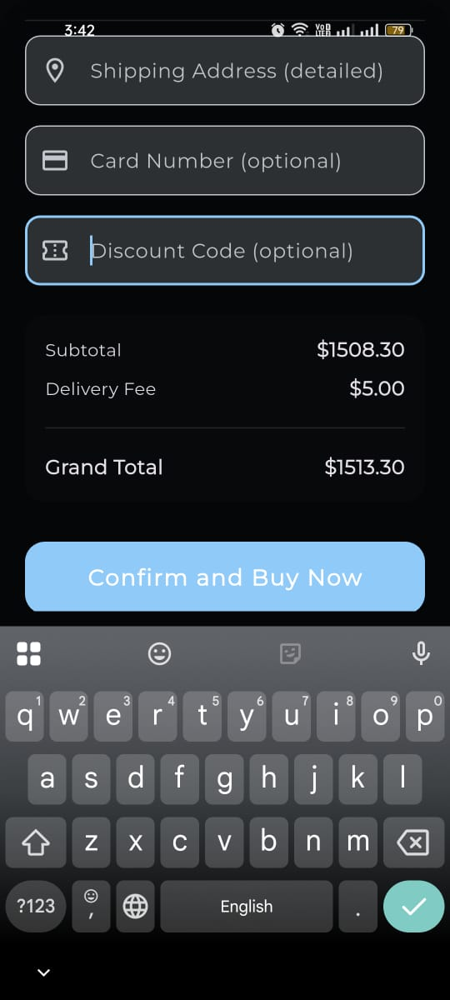 |
| 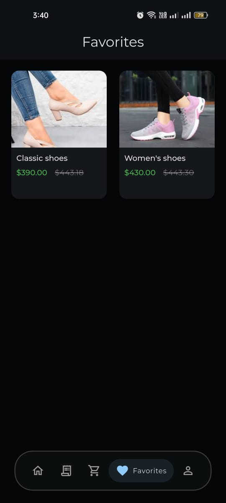 |

|:---:|:---:|

#### 📸 Profile Showcase:

|             Profile Page             |             Settings Page             | addProduct Page                            |
| :----------------------------------: | :-----------------------------------: | ------------------------------------------ | -------------------------------------- |
| 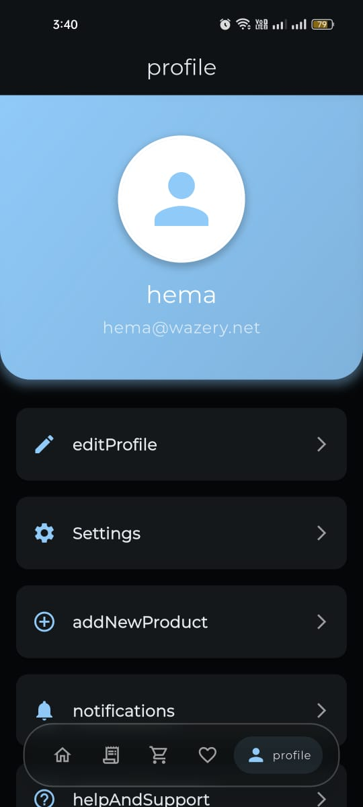 | 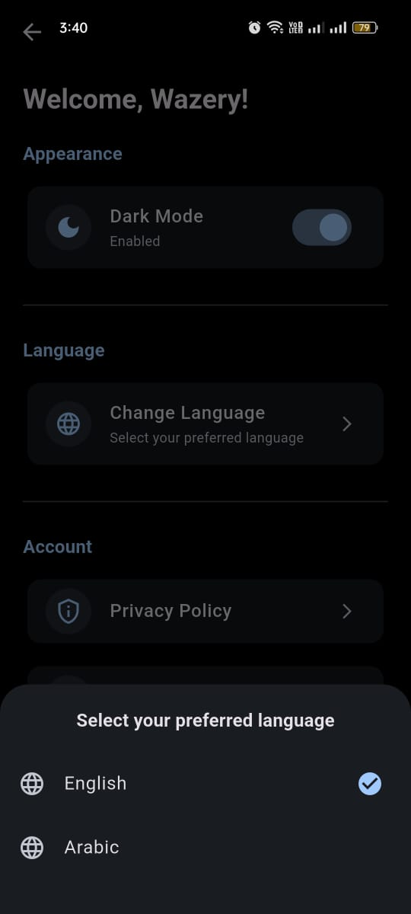 | 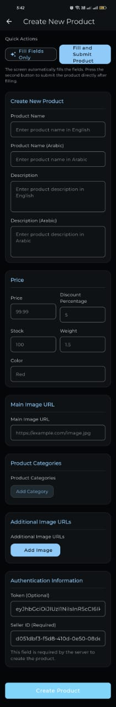 | 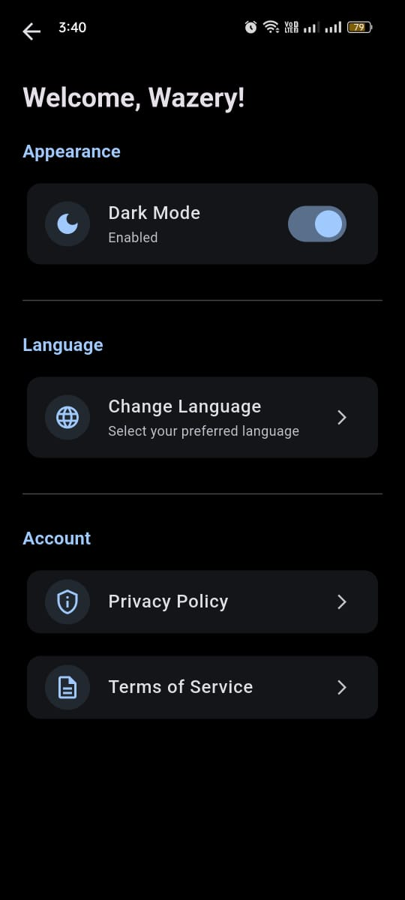 |

---

### 📊 Business Analytics & Merchant Portal (Seller Mode)

- **Merchant Portal:** Sellers can manage their inventory and add new products with multiple images.
- **Advanced Analytics:** Dynamic dashboards providing a quick analysis and full-scale business insights for merchants.

#### 📸 Seller & Analytics Showcase:

|                  Quickly Analysis                   |             Full Analysis Page              |
| :-------------------------------------------------: | :-----------------------------------------: |
|  |  |

---

### 🎨 UI/UX & Advanced Personalization

- **Premium Animations:** High-quality UX featuring staggered, item-by-item "bottom-to-top" entrance animations with subtle, elegant haptic-like vibrations for interactive elements.
- **Dynamic Theme Engine:** Full System-wide Dark Mode and Light Mode toggling.
- **Localization (Global Ready):** Native Multi-language support switching flawlessly between **Arabic** and **English**.

---

## 🛠️ Tech Stack & Architecture

The app is built using a modern, robust architecture optimized for low-end to high-end devices:

- **Architecture:** Clean Architecture (Presentation, Domain, Data layers) utilizing a **Feature-First** approach.
- **State Management:** **Cubit** (BLoC ecosystem) for predictable, clean business logic separation.
- **Navigation & Core UI:** **GetX** for high-performance context-less routing, dialogs, and core structural design.
- **Networking:** **Dio** client integrated with custom Interceptors for global error handling, authorization headers mapping, and optimized API caching.
- **Dependency Injection:** **GetIt** (Service Locator) for highly testable, decoupled dependency inversion.

---

## 📁 Project Structure (Clean Architecture)

```text
lib/
├── core/                  # Shared utilities, global network configurations, themes, constants
│   ├── network/           # Dio client, Interceptors, API endpoints
│   ├── theme/             # Dark/Light theme data definitions
│   └── utils/             # Core helpers & constants
└── features/              # Modular feature-first layers
    ├── addProduct/        # Adding new products with multiple images (Seller Flow)
    ├── auth/              # Login, Signup, OTP, and Validation
    ├── cart/              # Cart state management and interactions
    ├── checkout/          # Orders placement and checkout processing
    ├── favorites/         # Wishlist management system
    ├── home/              # Dynamic catalog, categories list, and search
    ├── orders/            # Order history and transactional logs
    ├── setting/           # Localization (Ar/En) and Theme Switching (Dark/Light)
    ├── splash/            # Branded, animated entry screen
    ├── singelProduct/     # Premium product details view and image sliders
    └── profile/           # User dashboard and profile updates
        ├── data/          # Models, Repositories implementations, Data Sources (API calls)
        ├── domain/        # Entities, Repository interfaces, Use Cases
        └── presentation/  # Cubit/BLoC state controllers, Screens, UI Widgets
```
